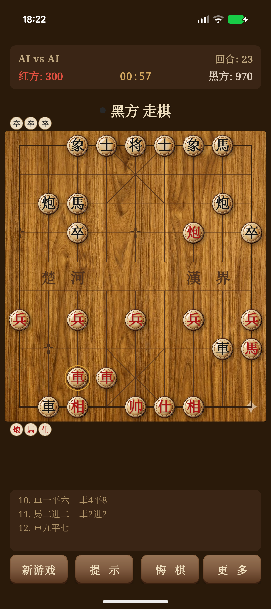

# 中国象棋 Chinese Chess

<p align="center">
  
</p>

<p align="center">
  <a href="https://play.google.com/store/apps/details?id=com.yingwang.chinesechess">
    
  </a>
</p>

<p align="center">
  <strong><a href="https://yingwang.github.io/chinese_chess_mobile/">Website</a></strong> ·
  <strong><a href="https://play.google.com/store/apps/details?id=com.yingwang.chinesechess">Google Play</a></strong> ·
  <strong><a href="PRIVACY_POLICY.md">Privacy Policy</a></strong>
</p>

A feature-rich Chinese Chess (Xiangqi) game for Android with a strong AI engine, neural network AI, classical UI, and endgame puzzles.

一款功能丰富的 Android 中国象棋游戏，拥有强力 AI 引擎、神经网络 AI、经典界面和残局练习。

## Features / 功能

### Game Modes / 游戏模式
- **Player vs AI / 人机对弈** — 5 difficulty levels + neural network AI / 5 个难度级别 + 神经网络 AI
- **Player vs Player / 双人对弈** — Same-device local multiplayer / 同设备本地双人
- **AI vs AI / AI 对弈** — Watch the engine play itself / 观看 AI 自我对弈
- **Endgame Puzzles / 残局练习** — 8 classic positions / 8 个经典残局 (重炮杀, 铁门栓, 天地炮, 马后炮, etc.)

### AI Engine / AI 引擎

The AI uses modern game engine techniques: / AI 使用现代博弈引擎技术：

| Technique / 技术 | Description / 描述 |
|-----------|-------------|
| Alpha-Beta Pruning / Alpha-Beta 剪枝 | Efficient minimax search / 高效极大极小搜索 |
| Null Move Pruning / 空步剪枝 | Skip-turn heuristic for fast cutoffs / 跳步启发式快速截断 |
| Late Move Reductions / 后期走法缩减 | Search late moves at reduced depth / 对后续走法降低搜索深度 |
| Iterative Deepening / 迭代加深 | Progressive depth with aspiration windows / 逐步加深搜索配合期望窗口 |
| Zobrist Hashing / Zobrist 哈希 | Fast position identification / 快速局面识别 |
| Transposition Tables / 置换表 | Depth-preferred replacement strategy / 深度优先替换策略 |
| Killer Move Heuristic / 杀手走法 | Remember refutation moves per depth / 记忆每层反驳走法 |
| History Heuristic / 历史启发 | Track historically successful moves / 追踪历史上成功的走法 |
| Quiescence Search / 静态搜索 | Resolve captures to avoid horizon effect / 解决吃子以避免水平线效应 |
| MVV-LVA Ordering / MVV-LVA 排序 | Most Valuable Victim – Least Valuable Attacker / 最有价值目标 - 最低价值攻击者 |
| Opening Book / 开局库 | 30+ classic opening lines / 30+ 条经典开局 |

#### Difficulty Levels / 难度级别

| Level / 级别 | Search Depth / 搜索深度 | Time Limit / 时间限制 | Quiescence / 静态搜索 |
|-------|-------------|------------|------------|
| Beginner / 初级 | 2 | 1s | Off / 关 |
| Intermediate / 中级 | 3 | 2s | Depth 2 / 2 层 |
| Advanced / 高级 | 4 | 3s | Depth 3 / 3 层 |
| Professional / 专业 | 5 | 5s | Depth 4 / 4 层 |
| Master / 大师 | 7 | 10s | Depth 5 / 5 层 |

### Neural Network AI / 神经网络 AI

An AlphaZero-style neural network engine, available as an additional difficulty level.

基于 AlphaZero 架构的神经网络引擎，作为额外的难度级别。

| Component / 组件 | Details / 详情 |
|-----------|---------|
| Architecture / 架构 | ResNet (128 filters, 6 residual blocks) with dual policy + value heads / ResNet（128 滤波器，6 残差块）双头：策略头 + 价值头 |
| Input / 输入 | 15 feature planes (10x9): 7 per side + current player / 15 个特征平面（10x9）：每方 7 个 + 当前玩家 |
| Policy Head / 策略头 | 2086 possible moves / 2086 种可能走法 |
| Value Head / 价值头 | Position evaluation in [-1, 1] / 局面评估值 [-1, 1] |
| Search / 搜索 | MCTS with 200 simulations / 蒙特卡洛树搜索，200 次模拟 |
| Training Data / 训练数据 | 40,000+ master game records (supervised learning) / 4 万+ 大师棋谱（监督学习）|
| Inference / 推理 | TensorFlow Lite (float16) on device / 设备端 TensorFlow Lite（float16）|

Training notebooks for Google Colab and Kaggle are in the `ml/` directory.

训练脚本（支持 Google Colab 和 Kaggle）位于 `ml/` 目录。

#### Evaluation Function / 评估函数

- Piece-square tables for all 7 piece types / 7 种棋子的位置价值表
- King safety (advisor/elephant guard) / 将帅安全（仕象护卫评估）
- Crossed-river bonuses (soldiers, horses) / 过河加分（兵、马）
- Chariot activity (open file bonus) / 车的活跃度（开放线路加分）
- Horse coordination (connected horses) / 马的协调性（连环马加分）
- Cannon endgame adjustment / 炮残局调整（跳板减少时降权）
- Threat detection (卧槽马, deep chariot penetration) / 威胁检测（卧槽马、车深入）

### User Interface / 用户界面

- Classical wood-grain board / 经典木纹棋盘
- 3D convex pieces with radial gradient and drop shadow / 3D 凸面棋子，径向渐变和投影
- Inner decorative ring (traditional xiangqi style) / 内圈装饰环（传统象棋风格）
- Warm gold selection glow with move indicators / 暖金色选中光效和走法提示
- Smooth 200ms piece movement animation / 流畅的 200ms 走子动画
- Haptic feedback on selection and placement / 选子和落子时触觉反馈
- Pulsing dots AI thinking indicator / AI 思考脉冲点指示器

### Additional Features / 其他功能

- **Save/Load / 存档读档** — Auto-saves on exit, resume on launch / 退出自动保存，启动时恢复
- **Hint System / 提示系统** — AI suggests the best move / AI 推荐最佳走法
- **Game Replay / 棋局回放** — Step through move history / 逐步浏览走棋历史
- **Undo / 悔棋** — Undo with confirmation / 确认后悔棋
- **Captured Pieces / 吃子显示** — Shows captured pieces above/below board / 棋盘上下显示被吃棋子
- **Turn Indicator / 回合指示** — Color dot shows whose turn / 颜色圆点显示当前回合
- **Move History / 走棋记录** — Chinese notation (e.g., 車五進九) / 中文记谱法
- **Foldable Support / 折叠屏支持** — Handles screen changes gracefully / 优雅处理屏幕变化

## Screenshots / 截图

<p align="center">
  <em>Screenshots coming soon / 截图即将添加</em>
</p>

## Building / 构建

### Requirements / 环境要求
- Android Studio Hedgehog or later / Android Studio Hedgehog 或更高版本
- JDK 17+
- Gradle 8.2+
- Kotlin 1.9.20+
- Min SDK 24 (Android 7.0) · Target SDK 35 (Android 15)

### Build & Install / 构建安装

```bash
git clone https://github.com/yingwang/chinese_chess_mobile.git
cd chinese_chess_mobile
./gradlew assembleDebug
./gradlew installDebug
```

## Architecture / 项目结构

```
app/src/main/java/com/yingwang/chinesechess/
├── model/                    # Game logic / 游戏逻辑
│   ├── Board.kt              # Board state, move validation / 棋盘状态、走法验证
│   ├── Piece.kt              # Piece movement rules / 棋子移动规则
│   ├── Move.kt               # Move representation / 走法表示
│   ├── Position.kt           # Board coordinates / 棋盘坐标
│   ├── PieceType.kt          # Piece types / 棋子类型
│   └── PieceColor.kt         # RED / BLACK / 红 / 黑
├── ai/                       # AI engine / AI 引擎
│   ├── ChessAI.kt            # Alpha-Beta search / Alpha-Beta 搜索
│   ├── Evaluator.kt          # Position evaluation / 局面评估
│   ├── TranspositionTable.kt # Transposition table / 置换表
│   ├── ZobristHash.kt        # Zobrist hashing / Zobrist 哈希
│   ├── OpeningBook.kt        # Opening book / 开局库
│   └── ml/                   # Neural network AI / 神经网络 AI
│       ├── MLChessAI.kt      # MCTS + neural network / MCTS + 神经网络
│       ├── TFLiteModel.kt    # TFLite inference / TFLite 推理
│       ├── MoveEncoding.kt   # Board/move encoding / 棋盘走法编码
│       └── MCTSNode.kt       # MCTS tree nodes / MCTS 树节点
├── ui/
│   └── BoardView.kt          # Board rendering / 棋盘渲染
├── audio/
│   └── GameAudioManager.kt   # Sound effects / 音效
├── GameController.kt         # Game flow / 游戏流程控制
├── EndgamePositions.kt       # Endgame puzzles / 残局练习
├── SoundManager.kt           # Fallback tone generator / 备用音调生成
└── MainActivity.kt           # UI wiring / UI 绑定
```

## Game Rules / 游戏规则

| Piece / 棋子 | Red / 红 | Black / 黑 | Movement / 走法 |
|-------|-----|-------|----------|
| General / 将帅 | 帅 | 将 | 1 step orthogonal, within palace / 九宫内直走一步 |
| Advisor / 仕士 | 仕 | 士 | 1 step diagonal, within palace / 九宫内斜走一步 |
| Elephant / 相象 | 相 | 象 | 2 steps diagonal, blocked by eye, no river / 田字斜走，塞象眼，不过河 |
| Horse / 马 | 馬 | 马 | L-shape, blocked by adjacent piece / 日字走，蹩马腿 |
| Chariot / 车 | 車 | 车 | Any distance orthogonal / 直线任意距离 |
| Cannon / 炮 | 炮 | 炮 | Moves like chariot, captures by jumping / 直走如车，隔子吃子 |
| Soldier / 兵卒 | 兵 | 卒 | Forward; forward + sideways after river / 前进；过河后可横走 |

Special: **Flying General** rule — generals cannot face each other on an open file.

特殊规则：**将帅照面** — 将帅不能在同一列无遮挡对面。

## Privacy / 隐私

This app does not collect any personal data. No internet connection required. No tracking, analytics, or ads. All game data is stored locally. See [Privacy Policy](PRIVACY_POLICY.md).

本应用不收集任何个人数据。无需网络连接，无追踪、分析或广告。所有数据存储在本地。详见 [隐私政策](PRIVACY_POLICY.md)。

## License / 许可

[GPL-3.0](LICENSE)

## Credits / 致谢

Built with Kotlin and Android Canvas. Inspired by [yingwang/chinese-chess](https://github.com/yingwang/chinese-chess) (web version).

使用 Kotlin 和 Android Canvas 构建。灵感来源于 [yingwang/chinese-chess](https://github.com/yingwang/chinese-chess)（网页版）。
