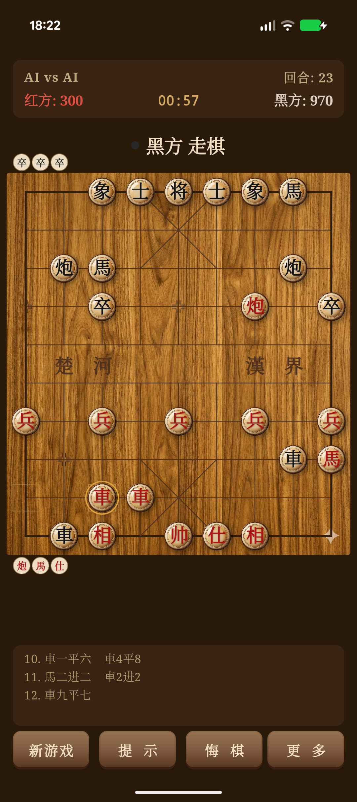

# 中国象棋 Chinese Chess

<p align="center">
  
</p>

<p align="center">
  <a href="https://play.google.com/store/apps/details?id=com.yingwang.chinesechess">
    
  </a>
</p>

<p align="center">
  <strong><a href="https://yingwang.github.io/chinese_chess_mobile/">Website</a></strong> ·
  <strong><a href="https://play.google.com/store/apps/details?id=com.yingwang.chinesechess">Google Play</a></strong> ·
  <strong><a href="https://yingwang.github.io/chinese_chess/">Web Version / 网页版</a></strong> ·
  <strong><a href="PRIVACY_POLICY.md">Privacy Policy</a></strong>
</p>

Chinese Chess (Xiangqi) for Android against Pikafish, the NNUE engine, running entirely on the phone: eight levels from complete beginner to beyond human, a review of every game, thirty endgame studies from the classical manuals, and an ink-and-jade look in dark and light.

Android 中国象棋，对手是在手机上本地运行的 Pikafish（NNUE 神经网络引擎）：八档难度从刚学会走棋到超越人类，每局都能复盘，三十道古谱残局，界面是墨玉与青玉的深浅两套。

## Features / 功能

### Game Modes / 游戏模式
- **Player vs AI / 人机对弈** — 8 difficulty levels powered by the Pikafish engine / 8 个难度级别，Pikafish 引擎驱动
- **Player vs Player / 双人对弈** — Same-device local multiplayer / 同设备本地双人
- **AI vs AI / AI 对弈** — Watch the engine play itself / 观看 AI 自我对弈
- **Endgame Puzzles / 残局练习** — 30 studies taken unaltered from the classical manuals / 30 道古谱原局（适情雅趣、烂柯神机、梦入神机等），see [ENDGAMES.md](ENDGAMES.md)
- **Practice or Challenge / 练习与挑战** — practice allows hints and take-backs; challenge games count towards a rating ladder, with neither / 练习模式可提示、悔棋；挑战模式计入积分，不能提示和悔棋

### Game Review / 复盘

- **Analysed while you play / 边下边分析** — while you think, the engine looks back over the game at depth 12, so the review is ready almost at once; the AI's turn, a hint or a replay take the engine back at once / 你思考时引擎在后台按 12 层回看走过的局面，复盘几乎一打开就有结果；轮到电脑、按提示或回放时立刻让出引擎
- **Graph of the game / 形势走势图** — the evaluation in pawns on a scale that fits the game; drag along it and the board follows / 按兵值画出整局形势，手指拖动，棋盘逐步跟着走
- **Engine's move at every step / 每一步的推荐** — an arrow on the board; stopping on a move gives it a two-second look, as deep as a hint / 每一步都画出引擎推荐的箭头，停留时再深算两秒，和提示一样深
- **Mistakes confirmed / 复核后的失误** — a move is called a mistake or blunder only when a depth-12 search before and after it agrees; jump from one to the next / 只有经 12 层复核确认的步子才标「失误」「败着」，可在失误之间跳转

### Look / 外观

- **Two themes / 两套主题** — 墨玉夜山, smoky ink and gold, by default, and 月白青玉, moon-white paper and pale jade; or follow the system / 默认深色「墨玉夜山」（烟墨灰配淡金），另有浅色「月白青玉」，也可跟随系统
- **Ink-wash landscape / 水墨山水** behind a jade board with gold lines / 背景是水墨山水，青玉棋盘配金色棋线
- **Kai pieces / 楷体棋子** — a subset of LXGW WenKai (SIL OFL 1.1), red in cinnabar and black in ink / 霞鹜文楷子集，红子朱砂、黑子墨色
- **English interface / 英文界面** — follows the phone's language, with moves in WXF notation (C2=5, H8+7) / 跟随手机语言，英文下用 WXF 记谱

### AI Engine / AI 引擎 — Pikafish

Powered by [Pikafish](https://github.com/official-pikafish/Pikafish), one of the strongest xiangqi engines in the world. Pikafish is a Stockfish fork rewritten for xiangqi rules, using NNUE (efficiently updatable neural network) evaluation.

由 [Pikafish](https://github.com/official-pikafish/Pikafish) 驱动，目前世界最强的象棋引擎之一。Pikafish 基于 Stockfish 改写，使用 NNUE 神经网络评估。

The engine runs as a native ARM64 binary on device, communicating via UCI protocol.

引擎以原生 ARM64 二进制文件在设备上运行，通过 UCI 协议通信。

#### Difficulty Levels / 难度级别

| Level / 级别 | Engine setting / 引擎设置 |
|-------|-------------|
| Novice / 新手 | depth 4, weighted draw among the 6 best moves / 4 层，在最好的 6 步里按分数抽一步 |
| Learner / 入门 | depth 4, the same draw held closer to the best / 4 层，同样抽签但更靠近最好的一步 |
| Beginner / 初级 (default / 默认) | depth 3 / 3 层 |
| Intermediate / 中级 | depth 6 / 6 层 |
| Advanced / 高级 | depth 10 / 10 层 |
| Professional / 专业 | depth 15 / 15 层 |
| Master / 大师 | depth 20 / 20 层 |
| Grandmaster / 棋圣 | 10 s per move / 每步 10 秒 |

Pikafish has no skill limiter, so Novice and Learner ask it for its six best moves and draw one, weighted by score; they never miss a mate or walk into one, and in 30 calibration games each they beat Beginner 0% and 13% of the time. From Beginner up a level changes only how far the engine searches, so Beginner plays the engine's own best move at depth 3. No Elo has been measured for these levels; the rating ladder in the app scores challenge games against its own nominal AI ratings (300 to 2300).

Pikafish 没有限制棋力的选项，所以新手和入门两档让它给出最好的 6 步，再按分数抽一步走；该杀的棋不会放过，也不会走进对方的杀局。各对初级下 30 局校准，胜率分别是 0% 和 13%。初级往上，难度只改变引擎往下算多深，所以初级走的是引擎在 3 层上认为最好的一步。各档没有实测过等级分；应用里的积分天梯只给挑战模式计分，按它自己设定的 AI 分值（300 到 2300）计算。

### On the Board / 棋盘上

- Board and pieces drawn in code, sharp on any screen / 棋盘和棋子由代码绘制，任何屏幕都清晰
- Legal moves as dots, captures as red marks, the last move in amber brackets / 可走位置是小点，能吃的子是红色标记，上一手用琥珀色角标
- Smooth piece animation and haptic feedback / 流畅的走子动画与触感反馈
- Optional evaluation bar, hidden by default / 形势条可选，默认隐藏

### Rules Enforcement / 规则检测

- **Perpetual check detection / 长将检测** — Perpetual check (same position 3 times with check) results in loss for the checking side / 同一局面出现3次且处于将军状态，长将方判负
- **Threefold repetition draw / 三次重复和棋** — Same position 3 times without check is a draw / 同一局面出现3次（无将军）判和棋
- **AI avoidance / AI 规避** — AI proactively avoids moves that would cause repetition penalties / AI 主动规避会导致判负的重复走法

### Additional Features / 其他功能

- **Save/Load / 存档读档** — Auto-saves on exit, resume on launch / 退出自动保存，启动时恢复
- **Hint System / 提示系统** — AI suggests the best move / AI 推荐最佳走法
- **Game Replay / 棋局回放** — Step through the game from a bar under the board / 棋盘下方的按钮条逐步回放
- **Undo / 悔棋** — Undo with confirmation (practice games) / 确认后悔棋（练习模式）
- **Captured Pieces / 吃子显示** — On each side's name card, grouped by kind (車×2  炮) / 显示在双方名牌上，按子力归类
- **Turn Indicator / 回合指示** — Color dot shows whose turn / 颜色圆点显示当前回合
- **Move History / 走棋记录** — Chinese notation (炮二平五), WXF in English (C2=5); export as text / 中文记谱，英文用 WXF，可导出
- **Foldable Support / 折叠屏支持** — Handles screen changes gracefully / 优雅处理屏幕变化

## Screenshots / 截图

<table>
  <tr>
    <td align="center"><br/>对弈 · 墨玉夜山</td>
    <td align="center"><br/>复盘 · 失误与推荐</td>
    <td align="center"><br/>对弈 · 月白青玉</td>
  </tr>
  <tr>
    <td align="center"><br/>古谱残局</td>
    <td align="center"><br/>八档难度</td>
    <td align="center"><br/>English · Review</td>
  </tr>
</table>

## Building / 构建

### Requirements / 环境要求
- Android Studio Hedgehog or later / Android Studio Hedgehog 或更高版本
- JDK 17+
- Gradle 8.9+
- Kotlin 2.0+
- Min SDK 24 (Android 7.0) · Target SDK 36 (Android 16)

### Build & Install / 构建安装

```bash
git clone https://github.com/yingwang/chinese_chess_mobile.git
cd chinese_chess_mobile
./gradlew assembleDebug
./gradlew installDebug
```

Release builds read the signing key from `keystore.properties` in the repository root (gitignored), or from the `CHESS_KEYSTORE`, `CHESS_KEYSTORE_PASSWORD`, `CHESS_KEY_ALIAS` and `CHESS_KEY_PASSWORD` environment variables:

```properties
storeFile=../chess-release.keystore
storePassword=...
keyAlias=chess
keyPassword=...
```

## Architecture / 项目结构

```
app/src/main/java/com/yingwang/chinesechess/
├── model/                    # Game logic / 游戏逻辑
│   ├── Board.kt              # Board state, move validation / 棋盘状态、走法验证
│   ├── Piece.kt              # Piece movement rules / 棋子移动规则
│   ├── Move.kt               # Move representation / 走法表示
│   ├── Position.kt           # Board coordinates / 棋盘坐标
│   ├── PieceType.kt          # Piece types / 棋子类型
│   ├── PieceColor.kt         # RED / BLACK / 红 / 黑
│   └── Fen.kt                # FEN in and out / FEN 读写
├── ai/                       # AI engine / AI 引擎
│   ├── PikafishEngine.kt     # Pikafish UCI wrapper / Pikafish UCI 通信
│   ├── WeakPlay.kt           # Weighted draw for the two lowest levels / 新手、入门两档的抽签走子
│   ├── Review.kt             # What a move cost, and its verdict / 每步代价与评语
│   ├── ChessAI.kt            # Fallback Alpha-Beta / 备用 Alpha-Beta 搜索
│   ├── Evaluator.kt          # Position evaluation / 局面评估
│   ├── TranspositionTable.kt # Transposition table / 置换表
│   ├── ZobristHash.kt        # Zobrist hashing / Zobrist 哈希
│   └── OpeningBook.kt        # Opening book / 开局库
├── ui/
│   ├── BoardView.kt          # Board rendering / 棋盘渲染
│   ├── EvalBarView.kt        # Evaluation bar / 形势条
│   └── EvalGraphView.kt      # Review graph / 复盘走势图
├── audio/
│   └── GameAudioManager.kt   # Music and sound effects / 音乐与音效
├── GameController.kt         # Game flow, background analysis, review / 对局流程、后台分析、复盘
├── EndgameStudies.kt         # Endgame studies from assets/endgames.json / 残局练习
├── MoveNotation.kt           # Chinese and WXF notation / 中文与 WXF 记谱
├── RatingSystem.kt           # Rating ladder for challenge games / 挑战模式积分
└── MainActivity.kt           # UI wiring, themes / UI 绑定、主题
```

## Game Rules / 游戏规则

| Piece / 棋子 | Red / 红 | Black / 黑 | Movement / 走法 |
|-------|-----|-------|----------|
| General / 将帅 | 帅 | 将 | 1 step orthogonal, within palace / 九宫内直走一步 |
| Advisor / 仕士 | 仕 | 士 | 1 step diagonal, within palace / 九宫内斜走一步 |
| Elephant / 相象 | 相 | 象 | 2 steps diagonal, blocked by eye, no river / 田字斜走，塞象眼，不过河 |
| Horse / 马 | 馬 | 马 | L-shape, blocked by adjacent piece / 日字走，蹩马腿 |
| Chariot / 车 | 車 | 车 | Any distance orthogonal / 直线任意距离 |
| Cannon / 炮 | 炮 | 炮 | Moves like chariot, captures by jumping / 直走如车，隔子吃子 |
| Soldier / 兵卒 | 兵 | 卒 | Forward; forward + sideways after river / 前进；过河后可横走 |

Special: **Flying General** rule — generals cannot face each other on an open file.

特殊规则：**将帅照面** — 将帅不能在同一列无遮挡对面。

## Privacy / 隐私

This app does not collect your name, contact details or any other personal information, and has no tracking, analytics or ads. Everything except the optional "Play a friend online" works without a network connection. An online game is stored in Google Firebase under an anonymous ID, readable only by the two players, and its room is deleted when the host cancels it or the last player leaves a finished game. All other data is stored locally. See [Privacy Policy](PRIVACY_POLICY.md).

本应用不收集姓名、联系方式或任何其他个人信息，无追踪、分析或广告。除了可选的「和朋友联机」，所有功能都无需网络连接。联机对局以匿名 ID 存在 Google Firebase 中，只有对局双方能读取；房主取消等人，或一盘下完、最后一方离开时，房间即被删除。其他数据都存储在本地。详见 [隐私政策](PRIVACY_POLICY.md)。

## License / 许可

[GPL-3.0](LICENSE)

## About / 关于

Built with Kotlin and Android Canvas, powered by [Pikafish](https://github.com/official-pikafish/Pikafish) engine. Also available as a [web version](https://github.com/yingwang/chinese_chess).

使用 Kotlin 和 Android Canvas 构建，搭载 [Pikafish](https://github.com/official-pikafish/Pikafish) 引擎。另有[网页版](https://github.com/yingwang/chinese_chess)。
